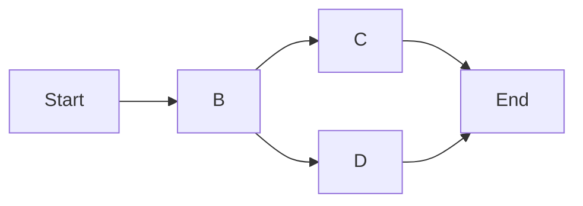
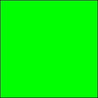

# Material for MkDocsの拡張機能

Material for MkDocsで利用できる拡張機能です。利用することでリッチなドキュメントを作成できますが、他のシステムでサポートされない機能が多く、**使用するほど標準のMarkdownからはかけななれていく**ので注意してください。

## リンク

* <https://squidfunk.github.io/mkdocs-material/reference/>

## Admonitions

* 注記を記述する機能で、[標準ライブラリの機能です](./markdown-extensions.md#admonition)
* 標準拡張の機能に加えて、アイコンのカスタムなどができます

## Annotations

* 文中にアイコンが表示され、マウスオーバーで文章が表示されます
* アイコンは数種類から選ぶことができます

```md
文中にアイコンが表示されます(1)。アイコンはオプションで変更できます。
{ .annotate }

1. 注記です。**インライン**の`Markdown`が利用できます。
```

以下のようにレンダリングされます。

---

文中にアイコンが表示されます(1)。アイコンはオプションで変更できます。
{ .annotate }

1. 注記です。**インライン**の`Markdown`が利用できます。

---

## Buttons

* ボタン形状のリンクを作成します

```md
[ボタン](/index.html){ .md-button }
```

以下のようにレンダリングされます。

[ボタン](/index.html){ .md-button }

## Code blocks

* [基本は標準ライブラリの機能です](./markdown-extensions.md#fenced-code-blocks)
* コピーボタンなどをつけることができます。

コピーボタンをつけるには以下のようにします。

```yaml
theme:
  features:
    - content.code.copy
```

## Content tabs

* タブを作ることができます。プログラミングごとのサンプルを同時に載せる場合などに適します

```md
=== "C++"

    ```c++
    #include <iostream>

    int main() {
        std::cout << "Hello, World" << std::endl;
    }
    ```

=== "Rust"

    ```rust
    fn main() {
        println!("Hello, World!");
    }

    ```
```

以下のようにレンダリングされます。

---

=== "C++"

    ```c++
    #include <iostream>

    int main() {
        std::cout << "Hello, World" << std::endl;
    }
    ```

=== "Rust"

    ```rust
    fn main() {
        println!("Hello, World!");
    }

    ```

---

有効化するには以下のように記述します。

```yaml
markdown_extensions:
  - pymdownx.tabbed:
      alternate_style: true
```

## Data tables

* [標準ライブラリと同じです](./markdown-extensions.md#tables)

## Diagrams

* Mermaid記法で図が書けます
* GitHubと同じ記法です

````md

````

以下のようにレンダリングされます。

---


---

有効化するには以下のように記述します。

```yaml
markdown_extensions:
  - pymdownx.superfences:
      custom_fences:
        - name: mermaid
          class: mermaid
```

## Footnotes

* 脚注がツールチップとして表示したり、複数行で記述できるようになります

```md
脚注[^1]を記述すると、ツールチップとして表示されます。

[^1]: 脚注の文章です。
```

以下のようにレンダリングされます。

---

脚注[^1]を記述すると、ツールチップとして表示されます。

[^1]: 脚注の文章です。

---

有効化するには以下のように記述します。

```yaml
theme:
  features:
    - content.footnote.tooltips
```

## Formatting

* フォーマット用の特殊なHTML要素を提供します

```md
* ==ハイライトされます==
* ^^下線が弾かれます^^
* ~~打ち消し線です。GitHubと同じです~~
* 100 cd/m^2^
* ++ctrl+alt+del++
```

* ==ハイライトされます==
* ^^下線が弾かれます^^
* ~~打ち消し線です。GitHubと同じです~~
* 100 cd/m^2^
* ++ctrl+alt+del++

有効化するには以下のように記述します。

```yaml
markdown_extensions:
  - pymdownx.critic
  - pymdownx.caret
  - pymdownx.keys
  - pymdownx.mark
  - pymdownx.tilde
```

## Grids

* グリッド状に並べます。トップページなどに使います

HTMLタグを利用しますが、Markdown構文を使って記述できます。

```md
<div class="grid cards" markdown>

- :fontawesome-brands-html5: __HTML__ for content and structure
- :fontawesome-brands-js: __JavaScript__ for interactivity
- :fontawesome-brands-css3: __CSS__ for text running out of boxes
- :fontawesome-brands-internet-explorer: __Internet Explorer__ ... huh?

</div>
```

以下のようにレンダリングされます。

<div class="grid cards" markdown>

- :fontawesome-brands-html5: __HTML__ for content and structure
- :fontawesome-brands-js: __JavaScript__ for interactivity
- :fontawesome-brands-css3: __CSS__ for text running out of boxes
- :fontawesome-brands-internet-explorer: __Internet Explorer__ ... huh?

</div>

有効化するには以下のように記述します。

```yaml
markdown_extensions:
  - attr_list
  - md_in_html
```

## Icons, Emojis

* アイコンや絵文字を簡単に利用できるようになります
* GitHubと同様の構文で利用できます

```md
:smile:
```

以下のようにレンダリングされます。

---

:smile:

---

有効化するには以下のように記述します。

```yaml
markdown_extensions:
  - attr_list
  - pymdownx.emoji:
      emoji_index: !!python/name:material.extensions.emoji.twemoji
      emoji_generator: !!python/name:material.extensions.emoji.to_svg
```

## Images

* 画像構文の拡張で、表示位置やサイズの指定を簡単に行えます

```md
{ width="300" }

{ width="50" align=left }

画像の横に文章を配置できます。
```

以下のようにレンダリングされます。

---

{ width="300" }

{ width="50" align=left }

画像の横に文章を配置できます。

---

有効化するには以下のように記述します。

```yaml
markdown_extensions:
  - attr_list
  - md_in_html
  - pymdownx.blocks.caption
```

## Lists

* [標準の拡張](./markdown-extensions.md#definition-lists)に加えて、タスクリストをサポートします
* 動的にチェックできるわけではなく、静的に表示されます

```md
- [x] チェック
- [ ] 未チェック
```

以下のようにレンダリングされます。

---

- [x] チェック
- [ ] 未チェック

---

有効化するには以下のようにします。

```yml
markdown_extensions:
  - pymdownx.tasklist:
      custom_checkbox: true
```

## Math

* MathJaxとKaTexで数式を記述できます

```md
$$
\cos x=\sum_{k=0}^{\infty}\frac{(-1)^k}{(2k)!}x^{2k}
$$
```

以下のようにレンダリングされます。

---

$$
\cos x=\sum_{k=0}^{\infty}\frac{(-1)^k}{(2k)!}x^{2k}
$$

---

有効化するには以下のように記述します。以下はMathJaxの有効化方法で、KaTexの有効化方法は異なります。

```yaml
markdown_extensions:
  - pymdownx.arithmatex:
      generic: true

extra_javascript:
  - javascripts/mathjax.js
  - https://unpkg.com/mathjax@3/es5/tex-mml-chtml.js
```

## Tooltips

* リンク構文の`title`を拡張し、ツールチップとして表示します。

```md
[リンク](http://example.com "ツールチップとして表示されます")
```

以下のようにレンダリングされます。

---

[リンク](http://example.com "ツールチップとして表示されます")

---

有効化するには以下のようにします。

```yaml
theme:
  features:
    - content.tooltips
```
