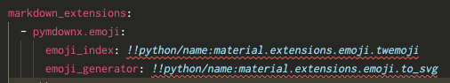

# Visual Studio Code (VS Code) の設定

## YAMLのカスタムタグ

Material for MkDocsを構成すると、以下のように記述する場面があります。

```yaml
markdown_extensions:
  - pymdownx.emoji:
      emoji_index: !!python/name:material.extensions.emoji.twemoji
      emoji_generator: !!python/name:material.extensions.emoji.to_svg
```

初期設定ではVS Codeはエラーを出力します。




```
Unresolved tag: tag:yaml.org,2002:python/name:material.extensions.emoji.twemoji
Unresolved tag: tag:yaml.org,2002:python/name:material.extensions.emoji.to_svg
```

エラーを抑制するにはVS Codeの設定 (`settings.json`) でYAMLのカスタムタグを設定します。

```json title=".vscode/settings.json"
{
  "yaml.customTags": [
    "tag:yaml.org,2002:python/name:material.extensions.emoji.twemoji",
    "tag:yaml.org,2002:python/name:material.extensions.emoji.to_svg"
  ]
}
```
